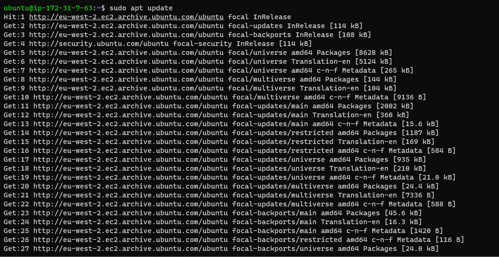
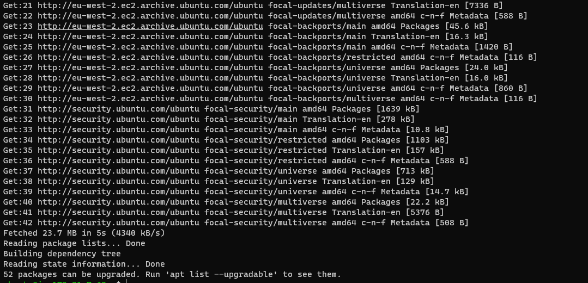
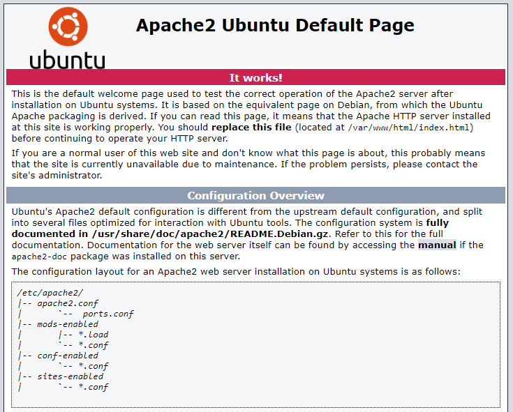
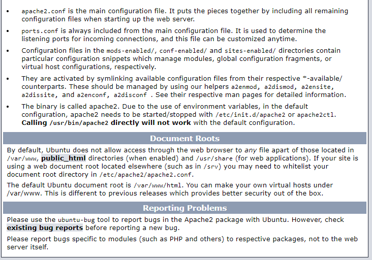

# Project 1 - LAMP Stack Implementation
___
___

### **Firstly the Ubuntu Server using the EC2 Instance on AWS has to be setup and the process is detailed below**
___

>#### Setting up new EC2 instance
#####  To setup the EC2 Linux Ubuntu Server is selected.

##### New EC2 instance of t2.micro family with Ubuntu Server 20.04 LTS (HVM) and key pair downloaded.

##### EC2 instance Network settings and security gruoup is configured

 

##### EC2 instance Network Launched Successfully

##### EC2 instance Up and Running

### **Step 1 Installing Apache and Updating the Firewall**
___
>#### Installing Apache using Ubuntu’s package manager ‘apt’

#####  To update a list of packages in package manager *`sudo apt update`* command is used and below images shows the status of the running update.

>#### Installing Apache2 Package 

#####  To install the Apache2 package *`sudo apt install apache2`* command is used and below images shows the status of the running update.

#####  The below image verifies that apache2 is running as a Service in my OS and the Web Server has been launched in the clouds.

>#### Testing the Newly Launch Apache HTTP server

#####  To Acces the HTTP Server  *`curl`* command can be used or through a web browser by using the public IP address of the server. Below Inage shows the server page via the web browser.

### **Step 2 INSTALLING MYSQL**
___

>#### Acquiring & Installing mysql server  using ‘apt’
#####  To install the mysql *`sudo apt install mysql-server`* command is used and below images shows the status of the running update.

#####  To logon to mysql console *`sudo mysql`* command is used and below images shows the logon status

#####  mysql root user password is altered with *`ALTER USER 'root'@'localhost' IDENTIFIED WITH mysql_native_password BY 'PassWord.1';`* command.

#####  To setup a secure  mysql console *`sudo mysql_secure_installation`* command is used and below images shows output of the command

#####  To confirm that the access to mysql console is secure *`sudo mysql -p`* command is used which will propmt for password to be inputed.

### **Step 3 INSTALLING PHP**
___
>#### To have the PHP up and running 3 Packages are required to be installed using "apt" 
* PHP Package
* PHP module that allows PHP to communicate with MySQL-based databases
* Enable Apache to handle PHP files
#####  To install all this 3 packages and other core php packages *`sudo apt install php libapache2-mod-php php-mysql`* command is used and below images shows the status of the running update.

#####  To check the php version *`php -v`* command is used and version details captured below.

### **Step 4  CREATING A VIRTUAL HOST FOR MY WEBSITE USING APACHE**
___
>#### Setting up the Virtual Host on Apache 
#####  The following command were used to set up the virtuahost
* *`sudo mkdir /var/www/projectlamp`* - (Creates a directory called  projectlamp)
* *`sudo chown -R $USER:$USER /var/www/projectlamp`* - (Change user ownerships of directory projectlamp)
* *`sudo vim /etc/apache2/sites-available/projectlamp.conf`* - (Create Virtual Host conf for projectlamp)
* *`sudo a2ensite projectlamp`* - (Enables projectlamp)
* sudo a2dissite 000-default - (Disables the  default site)
* *`sudo apache2ctl configtest`* - (Tests all configurations to ensure proper syntax)
* *`sudo systemctl reload apache2`* (Reloads the  Apache2 service)

#####  To Create an index.html file in the website to  test that the virtual host works as expected command *`sudo echo 'Hello LAMP from hostname' $(curl -s http://169.254.169.254/latest/meta-data/public-hostname) 'with public IP' $(curl -s http://169.254.169.254/latest/meta-data/public-ipv4) > /var/www/projectlamp/index.html`* is used.
#####  Opening the Website usng *`http://<Public-IP-Address>:80`* for the Public IP and *`http://<http://<Public-DNS-Name>:80`* using the Domain Name, display page is captured below.

### **Step 3 ENABLING PHP ON THE SERVER**
___
>#### To Enable the PHP Server file *index.html* and *index.php* has to be re ordered
#####  To Re-order the file *`sudo vim /etc/apache2/mods-enabled/dir.conf`* command is used to edit the conf in the ViM editor to make *index.php* take precedence over *index.html*
##### To create a PHP test script to confirm that Apache is able to handle and process requests for PHP files *`svim /var/www/projectlamp/index.php`*

